# 🧍 Blueprinty hráče (Player)

Tato část dokumentace popisuje blueprinty,
které se starají o **pohyb, animace a kameru hráče**.

---

## 🎮 Player Movement Blueprint

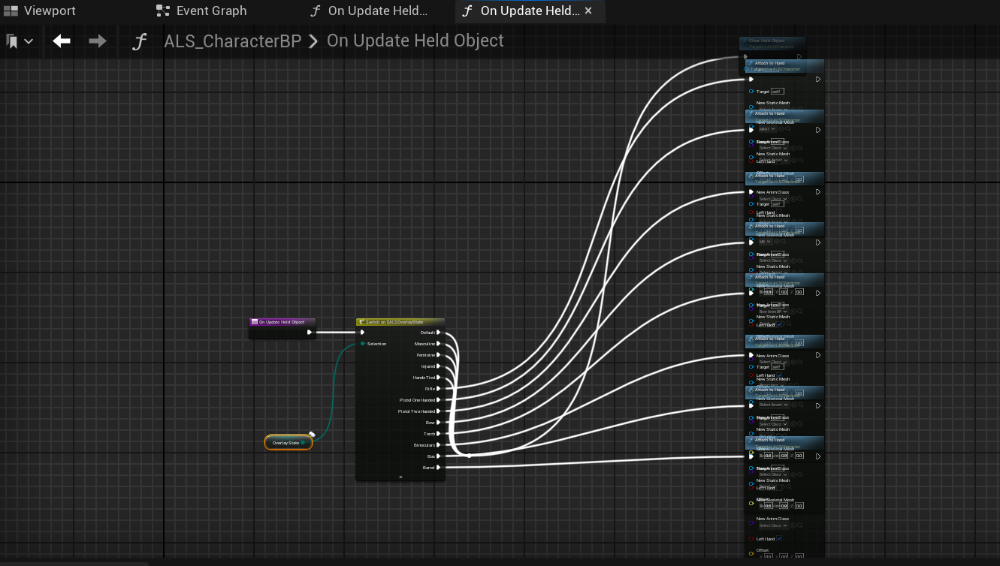
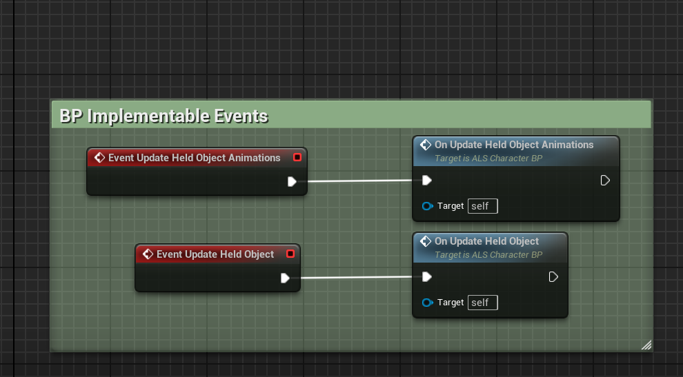
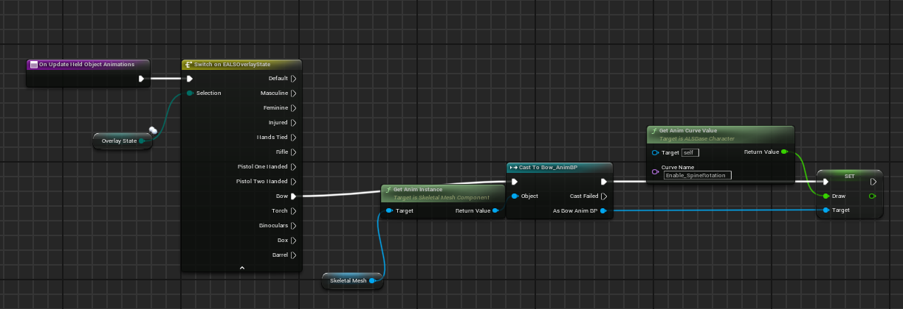

### Popis funkce
Tento blueprint zajišťuje:
- pohyb hráče dopředu, dozadu a do stran,
- skákání postavy,
- základní ovládání pomocí klávesnice.

### Jak funguje
- Vstupy z klávesnice jsou zpracovány pomocí Input Actions.
- Pohyb je řešen pomocí Character Movement komponenty.
- Skok je aktivován při stisknutí příslušné klávesy.

---

## 🎞 Animace postavy

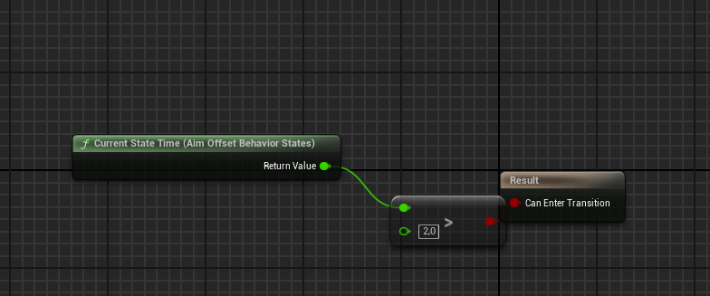
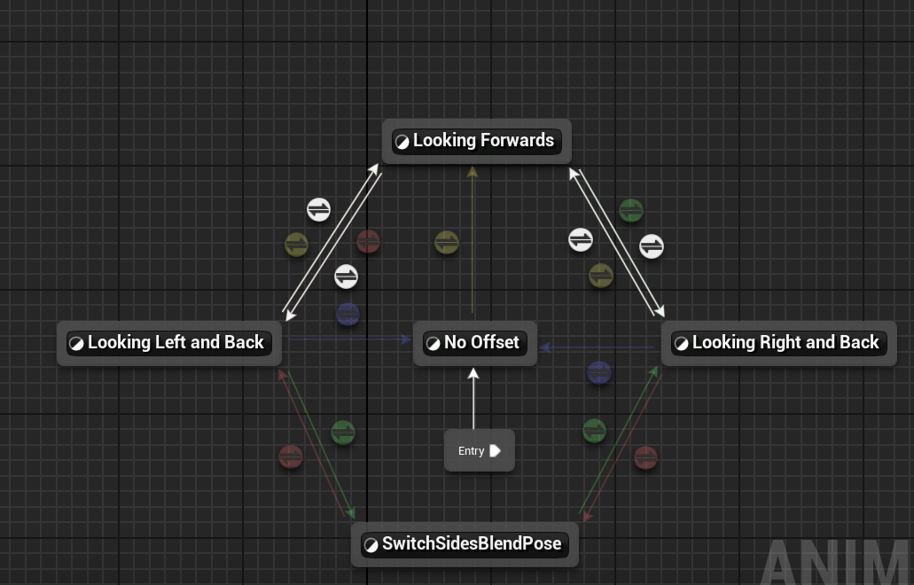
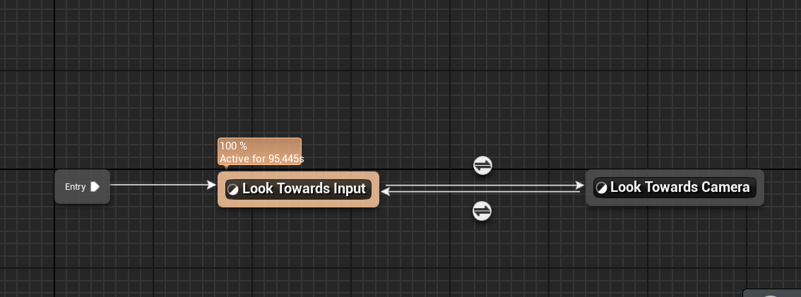
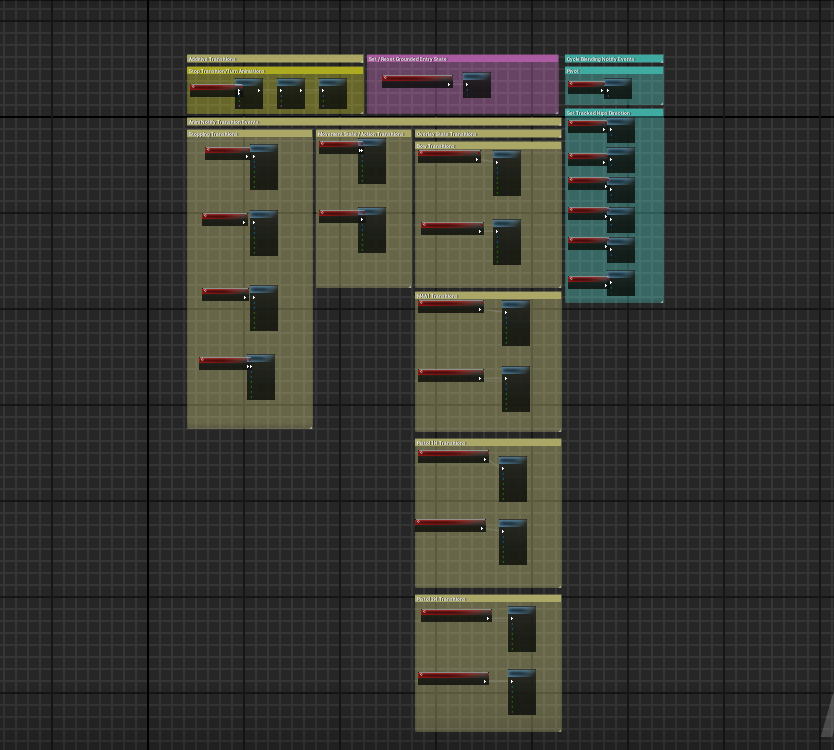
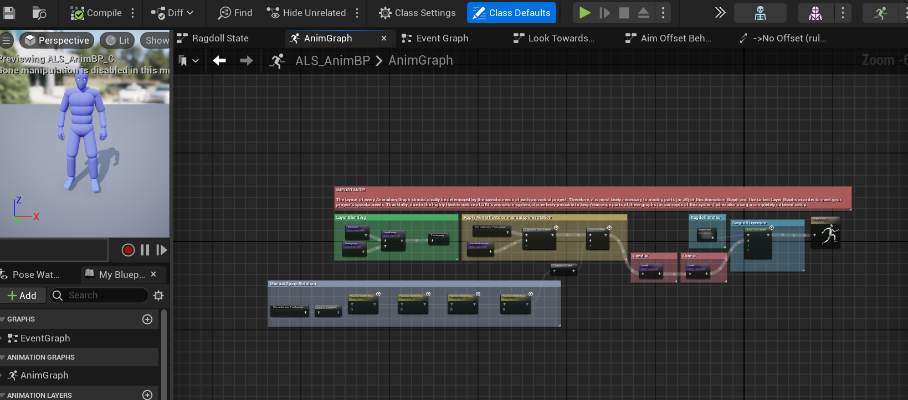
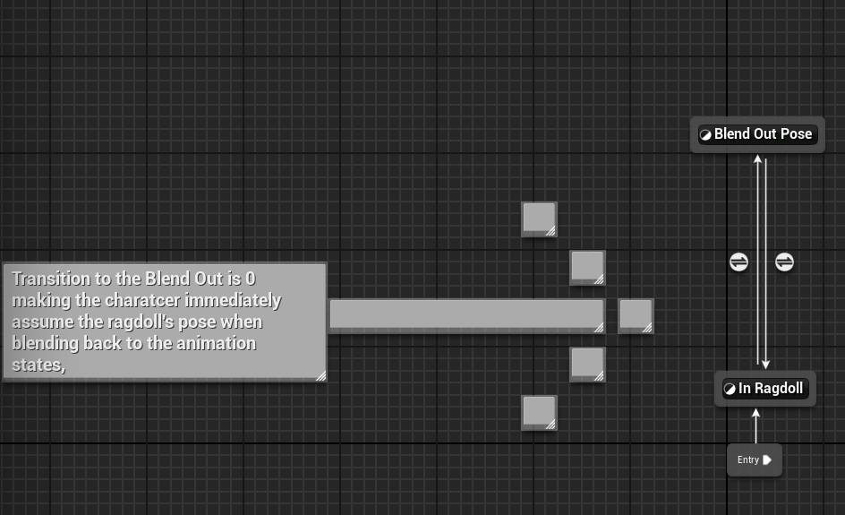
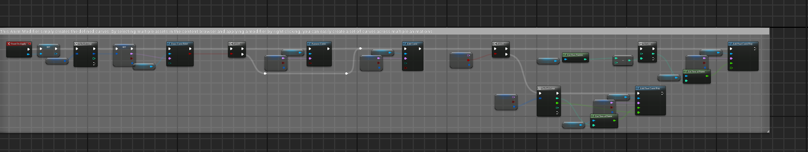
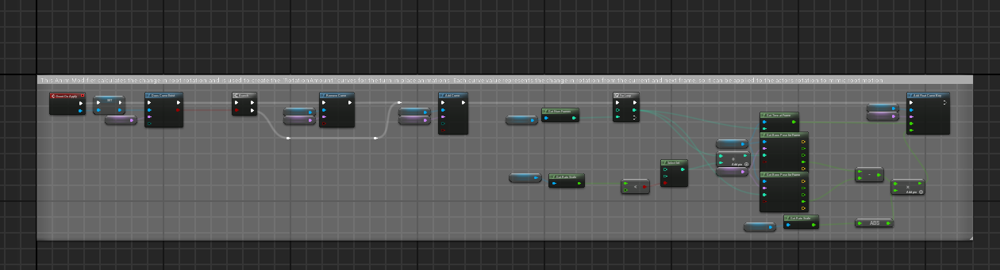
### Popis funkce
Blueprint propojuje:
- rychlost pohybu hráče
- stav skoku
- animace postavy

### Jak funguje
- Rychlost postavy se přenáší do Animation Blueprintu.
- Podle hodnot se přepínají animace chůze, běhu a skoku.

---

## 🎥 Third Person Camera

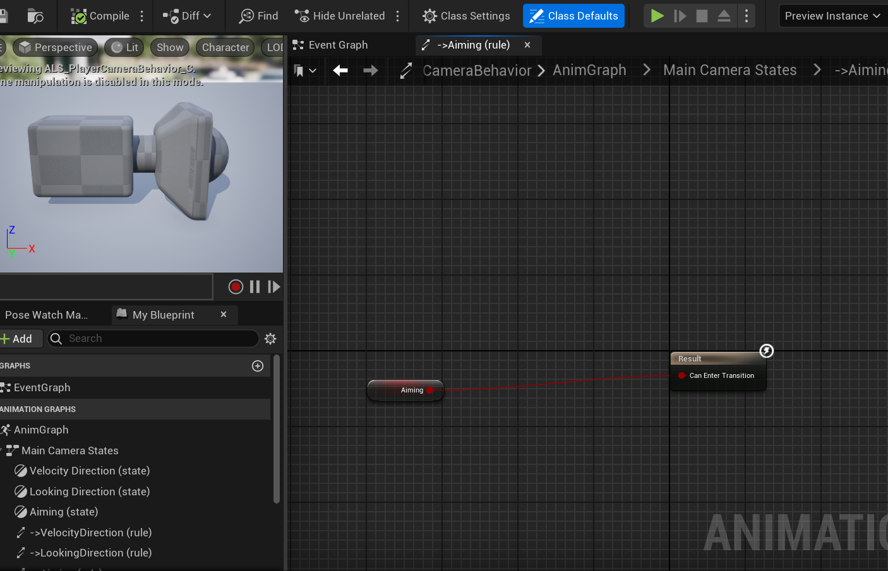
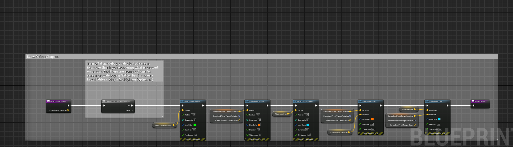

### Popis funkce
Tento blueprint zajišťuje:
- sledování hráče z pohledu třetí osoby,
- plynulé otáčení kolem postavy podle vstupu myši nebo gamepadu,
- možnost přibližování a oddalování kamery.

### Jak funguje
- Kamera je připojena k **Spring Arm komponentě**, která udržuje určitou vzdálenost od hráče.
- Rotace kamery se ovládá podle vstupů z **Input Axis** (myš / analogový joystick).
- Spring Arm zabraňuje průniku kamery do objektů pomocí **collision testu**.
- Při pohybu hráče se kamera hladce interpoluje, aby sledování bylo plynulé a nepůsobilo trhaně.

