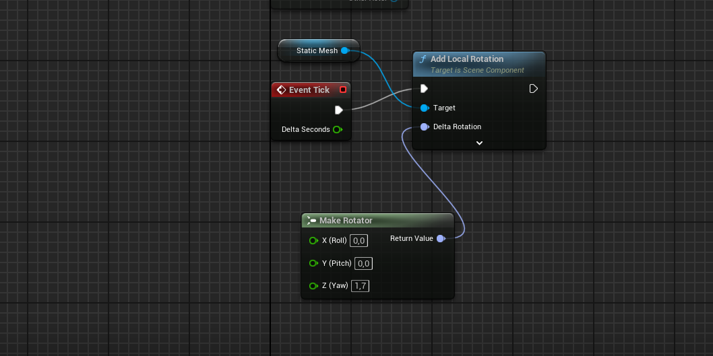
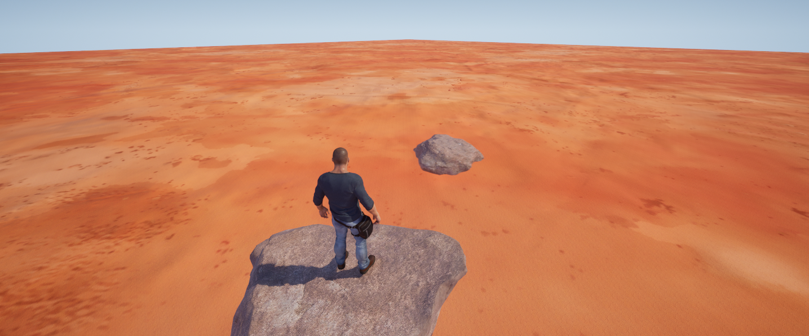

# Blueprint: Točící se kámen ve vzduchu

Tento Blueprint zajišťuje nepřetržitou rotaci Static Mesh objektu (kamene) kolem osy Z pomocí události **Event Tick**.

### Jak to funguje
- **Event Tick** spouští kód každý frame a poskytuje **Delta Seconds** (čas od posledního frame).
- **Make Rotator** vytvoří rotaci:  
  - Roll: 0°  
  - Pitch: 0°  
  - Yaw: 1.7° za sekundu  
- **Add Local Rotation** přidá tuto rotaci k Static Mesh komponentu (frame-rate independent díky Delta Seconds).

Výsledek: Kámen se plynule otáčí vertikálně konstantní rychlostí – ideální pro levitující objekty.

