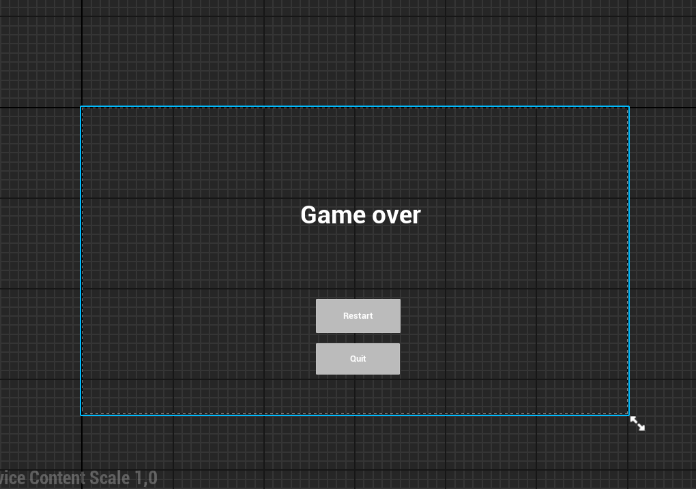
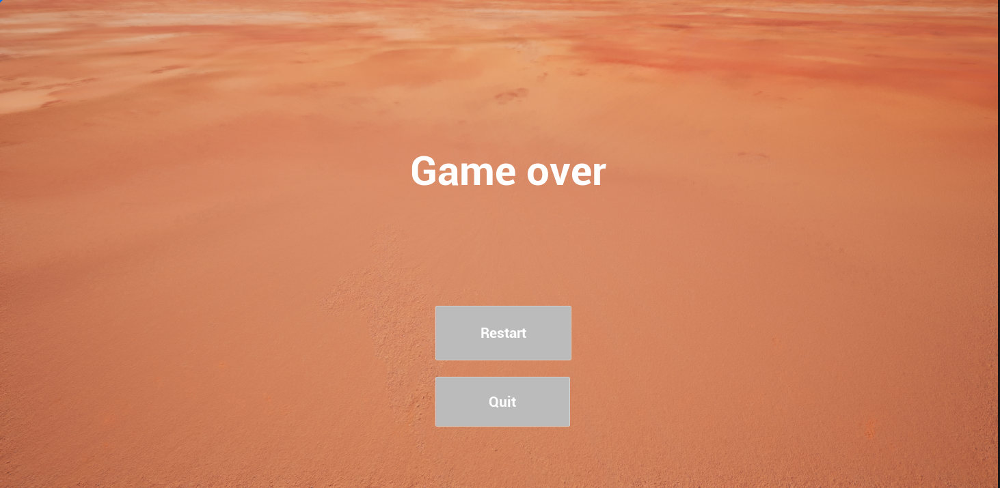
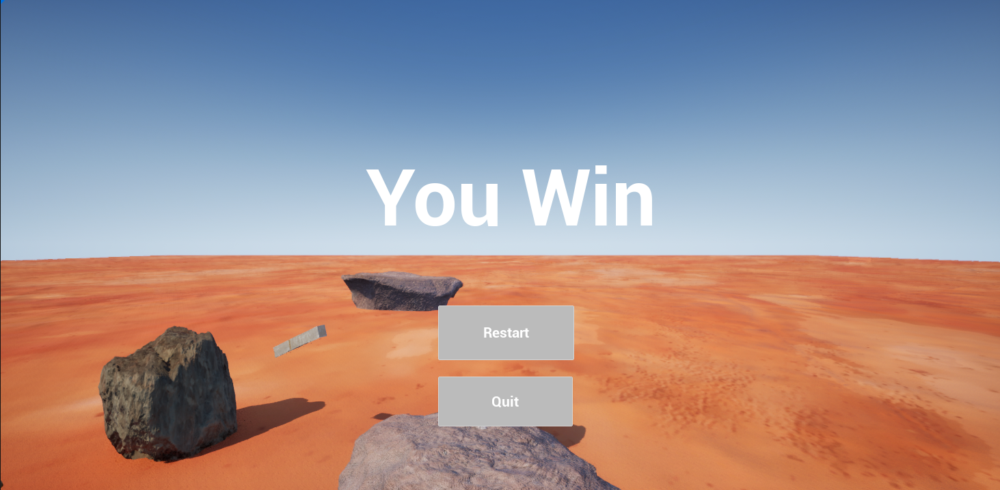

# 🖥 UI Blueprinty

Tato část dokumentuje **uživatelské rozhraní hry**.

---

## ❌ Game Over Widget

### Obsah widgetu
- Text „Game Over“
- Tlačítko **Restart**
- Tlačítko **Quit**

### Funkce
- Restart znovu načte úroveň.
- Quit ukončí hru.

---

## ✅ You Won Widget

### Obsah widgetu
- Text „You Won“
- Tlačítko **Restart**
- Tlačítko **Quit**

### Funkce
- Po výhře umožní hráči hru restartovat nebo ukončit.
