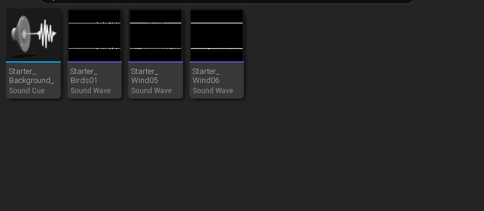
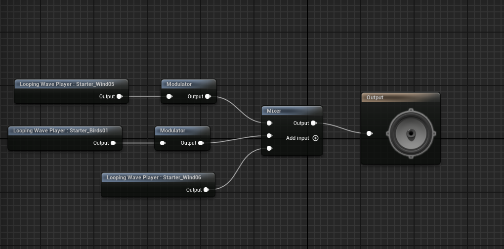
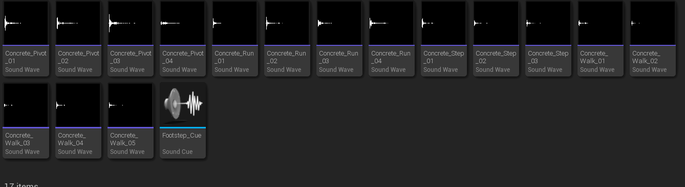
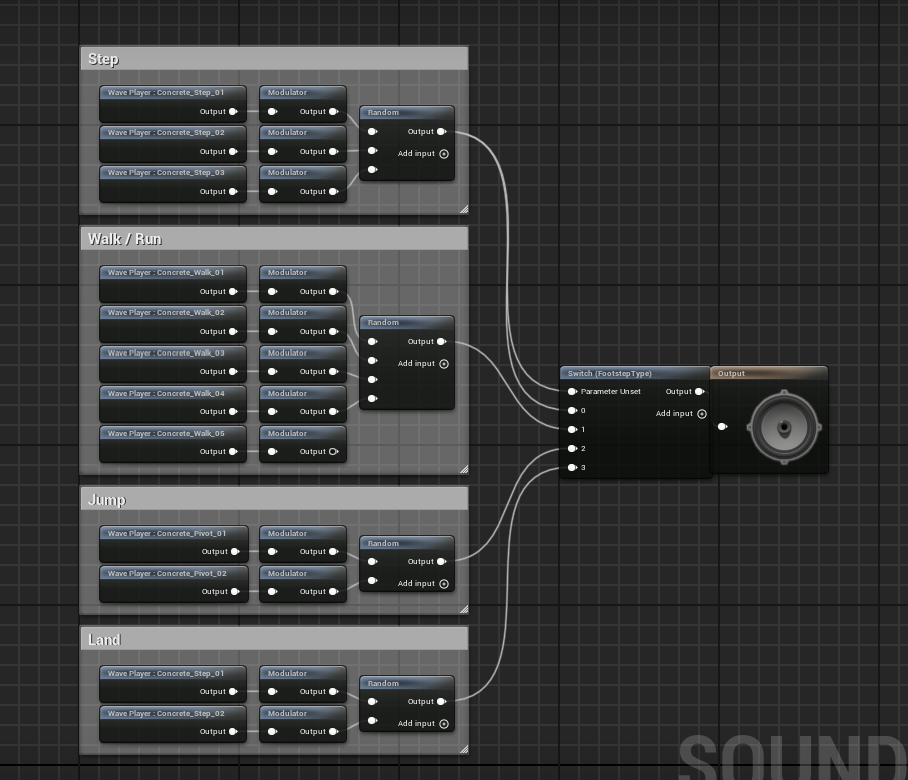

# Zvuky v projektu

V projektu jsem implementoval základní zvukovou vrstvu pomocí **Sound Cues** a **MetaSounds** v Unreal Engine. Zvuky jsou rozděleny do kategorií podle funkce (ambient, footstepy hráče).

### Ambientní zvuky (pozadí levelu)

Tyto zvuky běží nepřetržitě a vytvářejí atmosféru pouštního prostředí.

- **Starter_Background** – hlavní pozadí (nepoužito v konečné verzi)
- **Starter_Birds01** – zvuk ptáků
- **Starter_Wind05** – jemný vítr
- **Starter_Wind06** – silnější vítr

V MetaSounds jsou tyto tři looping Wave Playery (Birds01, Wind05, Wind06) připojeny přes samostatné Modulátory do Mixeru, který je vyveden na hlavní Output. Zvuky tak hrají současně a lze je individuálně ovládat hlasitostí.

### Zvuky kroků hráče (Footsteps)

Pro realističtější pohyb hráče jsem vytvořil systém náhodného výběru zvuků podle typu pohybu (Step, Walk/Run, Jump, Land) na povrchu betonu.

Každá kategorie má vlastní Sound Cue s několika variantami:

- **Step** – 3 varianty (Concrete_Step_01–03)
- **Walk / Run** – 5 variant (Concrete_Walk_01–05)
- **Jump** – 4 pivot varianty (Concrete_Pivot_01–04)
- **Land** – 2 varianty dopadu (Concrete_Step_01–02)

V každém Sound Cue je několik Wave Playerů připojeno přes Modulátor do **Random** nodu (bez opakování stejného zvuku po sobě), výstup jde do Mixeru/Switch.

Všechny čtyři kategorie jsou pak připojeny do jednoho hlavního **Switch (FootstepType)**, který podle parametru (0–3) vybere správnou kategorii zvuku při přehrání.

Tento systém zajišťuje variabilitu kroků a eliminuje opakující se stejné zvuky při pohybu hráče.

Pokud bude potřeba přidat další povrchy (písek, kov apod.), stačí rozšířit Switch o další větev a přidat nové Sound Cues.
